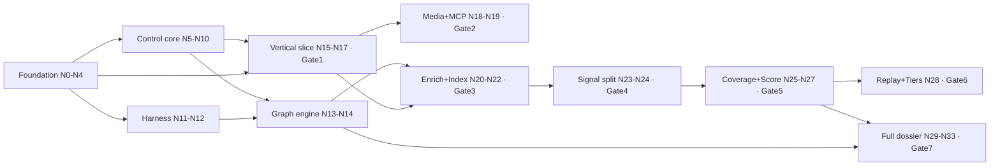

# AGENT_BUILD_CONTRACT.md

**Authority:** this file governs how the build agent constructs `trail-signal-os`. It supersedes the agent's default behavior and any impulse to free-roam. `AGENTS.md` defers to this file for anything build-related. Violating this contract is a build failure, not a style difference.

> **Scope.** Authoritative for the **build process** — the build graph, gates, and guards that construct
> the system. The runtime reasoning behavior of the finished system is governed by `AGENTS.md`. Both
> contracts sit under LAW 1 & 2 (control_plane_v4 §0), which override either on conflict.

---

## 0. Prime directive — graph architecture, not loops

You will build this system the way the system itself works: **as a graph, not a loop.** You do not wander a monologue loop deciding what to do next. You traverse a **build DAG** in dependency order, where every node is validated before any node that depends on it may begin. Loops exist only *inside* a node, bounded, exactly as doc 07 §0 mandates for the runtime. The medium matches the message: you build a graph engine using a graph-structured process.

Concretely, this forbids: building breadth-first, stubbing a dependency to "come back later," marking a node done without its gate, or implementing a node whose dependencies aren't green. It requires: topological traversal, per-node validation, and integration proven at every edge ("connective build").

---

## 1. Source of truth — the doc set is law

Build **only** what these docs specify. Do not invent architecture. If you find yourself designing something not in the docs, stop.

### TIER 0 — Invariants (override everything, non-negotiable)

| Ref | Source of truth |
|---|---|
| LAW 1, LAW 2 | `docs/build/control_plane_v4_signal_engine.md §0` — binds both contracts |

### TIER 1 — Contracts (disjoint scopes)

| Contract | Scope |
|---|---|
| `AGENTS.md` | runtime reasoning + evidence discipline |
| `AGENT_BUILD_CONTRACT.md` | build process (graph, gates, guards) |

### TIER 2 — Domain specs (under AGENTS.md) → `docs/domain/`

| Doc | Governs |
|---|---|
| `00_mission_and_thesis` | mission, thesis |
| `01_ontology_and_data_model` | domain ontology, entities |
| `03_evidence_standard` | what counts as valid evidence |
| `04_seasonality_engine` | seasonal/trend triggers |
| `09_safety_compliance_and_ethics` | exclusion screen, content safety *(shared: build enforces it as guards/policies)* |
| `10_expansion_roadmap` | roadmap |
| `11_data_dictionary` | field definitions |
| `12_query_grammar` | query construction |

### TIER 2 — Build specs (under AGENT_BUILD_CONTRACT) → `docs/build/`

| Doc | Governs | Precedence |
|---|---|---|
| `control_plane_v3_24gb` | durable control plane, gateway, token API, routing, security, fairness | supersedes v2 & original |
| `control_plane_v4_signal_engine` | signal infra, **LAW 1 & 2**, lineage, coverage gate, versioned re-scoring | extends v3 |
| `06_source_degradation` | acquisition, degradation ladder, no-evasion, source tiers | authoritative for degradation |
| `07_agent_graph_engineering` | graph-as-data, node contract, verifiers | supersedes `06_agent_orchestration` |
| `08_signal_engine` | deterministic scoring math *(shared: AGENTS.md defers here for scoring)* | supersedes `05_scoring_and_gates` |
| `09_verification_harness` | build gates, guards, fixtures, cassettes | — |
| `repo_layout` | physical file layout | — |
| `environment_profile` | physical host: hardware, memory budgets, ports, service reuse, Polymath coexistence | authoritative for environment; overrides v3 §1 host assumptions |
| `adr/001_no_framework_fork` | framework-fork decision | — |

**Contract precedence order** (on the rare intra-build conflict): `09_verification_harness` > `control_plane_v4` > `control_plane_v3` > `06/07/08` > `repo_layout`. A gate always beats a prose description.

`docs/archive/*` is superseded reference only — never governing.

**Ambiguity protocol** (never guess silently):
- Ambiguity touching an **invariant, law, or gate** → HALT, write `BLOCKED.md` (doc 09 §5), do not proceed.
- **Cosmetic** ambiguity (naming, file split) → proceed, record the choice in an ADR stub under `docs/adr/`, keep going.

---

## 2. The build graph

Materialize this as **`build_graph.yaml`** on first run and maintain it as you go — it is the live source of truth for what is built and what is admissible next. Render it to Mermaid on each update (doc 07 gut-check #3: control flow must be readable as a diagram).

**Node schema** (mirrors doc 07 §2, applied to build steps):
```yaml
- id: N16
  produces: [workers/http_worker.py, workers/extract_worker.py]   # paths per docs/build/repo_layout.md
  depends_on: [N5, N6, N4, N3]
  verifier: gate-1                       # the gate/guards that prove this node (doc 09)
  integration_check: "fetch fixture URL → page.v1 → lineage edge"  # the CONNECTIVE assertion
  status: PENDING                        # PENDING | ADMISSIBLE | IN_PROGRESS | DONE | BLOCKED
  max_fix_attempts: 6
  commit: null                           # filled with the SHA when DONE (§5)
```

**The DAG** (grouped by the gate each rolls up to; file lists live in `docs/build/repo_layout.md`, gate detail in doc 09 §2 — do not restate, reference):

```
FOUNDATION
  N0 infra            deps —          → Gate 0 (bootstrap)
  N1 schemas          deps —          verifier: schema round-trip
  N2 db               deps N0,N1      migrations apply; unique constraints + indexes (guard 3)
  N3 fixtures         deps N1         fixtures+cassettes+goldens+camping-fixture load & validate
  N4 guards           deps N1,N2      make verify-guards: all 12 poison tests fire   ← built BEFORE guarded code
CONTROL CORE
  N5 leases           deps N2,N4      fencing poison (g2), reaper reclaim
  N6 dispatcher+outbox deps N2,N4     outbox atomicity (g4), restart-Redis republish
  N7 scheduler        deps N2         admission + budgets + fairness
  N8 retries+circuits deps N2         429 cooldown, circuit open/close
  N9 reconciler       deps N5,N6,N2   republish missing, flag orphans (supports g6)
  N10 control-api     deps N7,N5,N6   /readyz gated on reconciler first pass (doc 09 §4)
HARNESS (lift + untangle, ADR-001)
  N11 gateway         deps N0         roles from models.yaml, hooks stripped, cassette replay
  N12 node_executor   deps N11        runs a node with verifier + iteration ceiling
GRAPH ENGINE
  N13 verifiers       deps N1         each verifier in the catalog unit-tested (doc 07 §4)
  N14 compiler+executor deps N2,N12,N13  compile YAML→rows, render Mermaid, execute a node
VERTICAL SLICE
  N15 search worker   deps N10,N3     SearXNG (fixture) → query_specs
  N16 http+extract    deps N5,N6,N4,N3  fetch → page.v1
  N17 lineage         deps N2,N4      edges/trace (g6) [replay/diff validated later at Gate 6]
    ⇒ GATE 1 = {N5,N6,N16,N17}: query→fetch→extract→page.v1→edge→trace-to-query_spec; kill-worker→one artifact
MEDIA + MCP
  N18 media worker    deps N16,N8     yt-dlp auto-sub on fixtures; trickle + degradation (doc 06)
  N19 mcp             deps N10,N17    create_job/status/bundle round-trip; dup-message→one result   ⇒ GATE 2
ENRICH + INDEX
  N20 enrich worker   deps N11,N4     evidence.v1 via cassette validates; invalid→repair NOT index
  N21 index worker    deps N20,N2     Qdrant search returns
  N22 governor        deps N7,N16,N20 phase gating + backpressure under memory pressure              ⇒ GATE 3
SIGNAL SPLIT
  N23 classify+normalize deps N20,N4,N17  split (LAW 1); write-guard fires (g5); normalize invariants (g11)
  N24 confidence      deps N23        deterministic confidence                                        ⇒ GATE 4
COVERAGE + SCORE
  N25 coverage        deps N23,N2     gate admits, else scores-with-gaps
  N26 score           deps N24,N25,N4 reproducible (g12); camping-fixture → 0.72
  N27 explain         deps N26,N11    explains, never scores (g5)                                     ⇒ GATE 5
REPLAY + TIERS
  N28 tiers           deps N26,N24    discount + hostile-dependence cap; tier-loss → no evasion (g10)
    (N17 lineage.replay/diff validated here: replay reproduces score; diff shows weights delta)       ⇒ GATE 6
FULL DOSSIER
  N29 freshness       deps N26,N7     expiry → re-collection
  N30 decide          deps N26,N11    constraint-fit re-rank (det) + rationale (llm, split)
  N31 graph/defs      deps N14 (+referenced node types)  research.yaml + dossier.yaml compile & execute
  N32 job-hierarchy+validate deps N7,N14,N26  dossier parent/child jobs; VALIDATE fan-out sub-graph
  N33 ACCEPTANCE      deps ALL        camping-fixture → dossier → 0.72; trace complete; replay reproduces
                                       = Definition of Done (doc 09 §6)                               ⇒ GATE 7
```

Layer-level dependency shape:



---

## 3. Traversal protocol

```
loop until all nodes DONE:
  admissible = { n : n.status==PENDING and all(dep.status==DONE for dep in n.depends_on) }
  if admissible is empty and not all DONE:  → deadlock; HALT + BLOCKED.md
  pick n from admissible in gate order (lowest gate first, then lowest id)
  n.status = IN_PROGRESS
  attempts = 0
  loop:                                             # the ONLY loop, bounded, inside the node
     implement n.produces per docs/build/repo_layout.md + governing doc
     r_unit  = run node tests
     r_integ = run n.integration_check              # CONNECTIVE: prove it works WITH its deps, not in isolation
     r_gate  = run gate for n (doc 09 §2) if this node closes a gate
     if r_unit and r_integ and r_gate all PASS:
        commit(one commit, message "N<id>: <produces>", tests included)
        n.status = DONE ; n.commit = SHA
        ledger.append(n.id, PASS, SHA)              # progress_ledger.csv, append-only
        update build_graph.yaml + re-render Mermaid
        break
     attempts += 1 ; ledger.append(n.id, FAIL, SHA, r.failing)
     if attempts >= n.max_fix_attempts:
        n.status = BLOCKED ; write BLOCKED.md {node, failing_checks, last_error, hypotheses} ; HALT
```

**Admissibility is the connective enforcement.** You physically cannot build a dependent before its dependency is proven — so every line of code lands on a validated foundation. This is the build-time analogue of the control plane's own dependency resolution and coverage gating.

**One commit per node.** Commit granularity = build-graph node, message prefixed with the node id, tests in the same commit. The git history therefore *is* the graph traversal — fully traceable, each node a reviewable unit. This is your "code traceability" value applied to the build itself.

---

## 4. Non-negotiable: guards, determinism, honesty

- **Guards are born early (N4) and stay active.** From N4 onward, every component is created under the 12 guards (doc 09 §1). You never write guarded code before its guard exists.
- **Gates run offline and deterministic.** Live web is forbidden in gates — use fixtures. LLM calls in gates run **replay-only** against cassettes (doc 09 §3); a missing cassette is a hard failure, never a silent live call. `make smoke-live` (non-gating) is the only place the real model runs.
- **LAW 1 / LAW 2 are absolute.** No LLM ever emits a score (guard 5, import-purity guard 9). Every derived artifact writes a lineage edge to its parents (guard 6). If a node would violate either, it is misdesigned — stop and re-read v4 §0.
- **Goalpost guard.** You may **never** turn a check green by editing a gate, a golden, a cassette-expectation, `expected_opportunity.json`, or a node's `integration_check` to match broken output. These are baseline-hashed (doc 09 §5); any change is flagged and blocks. Fix the code, never the goalpost.

---

## 5. Per-node output discipline

Every DONE node must have produced: (1) the code files at their `docs/build/repo_layout.md` paths; (2) node tests + the `integration_check`, wired so its gate can run them; (3) an updated `build_graph.yaml` status + re-rendered Mermaid; (4) a `progress_ledger.csv` entry; (5) exactly one commit, id-prefixed, tests included. A node missing any of these is not DONE regardless of whether the code "works."

---

## 6. Definition of done (the build is finished when — doc 09 §6)

1. Every node in `build_graph.yaml` is `DONE`.
2. Gates 0–7 all `PASS` in `progress_ledger.csv`.
3. `make verify-guards` green — all 12 poison tests fire.
4. Offline end-to-end: `camping-fixture` → full dossier → **opportunity 0.72**, `lineage.trace` complete to `query_spec` leaves, `lineage.replay` reproduces byte-for-byte.
5. No outstanding `BLOCKED.md`, no un-acknowledged goalpost flag.

Until all five hold, the build is *in progress*, never *done* — regardless of how complete it looks.

---

## 7. On "Graphify" / graph tooling

The mechanism above — a maintained `build_graph.yaml`, admissibility-gated traversal, Mermaid render — is tool-agnostic. If you have a specific graph tool ("Graphify" or otherwise), it slots in as the **store and renderer** for `build_graph.yaml` and the traversal state; the contract's rules (admissibility, per-node gates, connective checks, one-commit-per-node, goalpost guard) are unchanged. The graph discipline is the requirement; the graph library is an implementation detail.

> Traverse the graph, don't wander a loop. Build only on green. Prove every edge. Commit one node at a time. Never move a goalpost. An output you can't trace or reproduce is a build failure, not a result.
